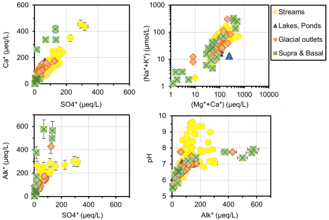
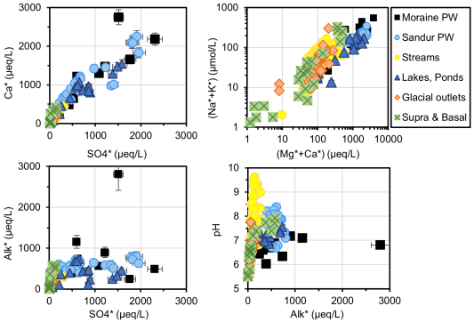

# A Chemical Weathering Model of Proglacial Waters at Kangerlussuaq, Western Greenland #

[Chemical weathering](https://en.wikipedia.org/wiki/Weathering#Chemical_weathering)
of minerals is one of the processes affecting the uptake of
carbon dioxide (CO2) from the atmosphere. Studies of chemical
weathering in [glacial](https://en.wikipedia.org/wiki/Glacier) and
[periglacial](https://en.wikipedia.org/wiki/Periglaciation) environments
are useful because there is less influence of biological processes at
lower temperatures.

At the [Kangerlussuaq area](https://en.wikipedia.org/wiki/Kangerlussuaq), 
several studies on chemical weathering have been performed and published
in scientific journals. Fig.1 shows the study area as well as the
sampling locations for the scientific studies discussed here.
In addition to being ideal for studies on weathering under periglacial
conditions, this area has an international airport, a seaport, and a gravel road
that facilitates the transport of scientific equipment all the way to the
ice sheet margin. The area is cold and arid, with only 173 mm of annual
precipitation (rain and snow) and a mean annual temperature around &minus;5&deg;C.
Land areas (not covered by lakes) have a few hundred metres-deep
[permafrost.](https://en.wikipedia.org/wiki/Permafrost)

A [geochemical model](https://en.wikipedia.org/wiki/Geochemical_modeling)
is presented here to describe the chemical weathering
processes taking place at the Kangerlussuaq area. They are the source
of solutes in the waters sampled. The model is implemented using
the [PhreeqC](https://www.usgs.gov/software/phreeqc-version-3) software
([Parkhurst and Appelo 2013][26]).
It is a reaction path model, that is, chemical equilibrium is assumed,
and [kinetics](https://en.wikipedia.org/wiki/Chemical_kinetics) are
not considered.

  
**Figure 1.** Map of the Kangerlussuaq study area. The ice sheet is to right
in blue. Some lakes and streams are shown in darker blue, land areas in a
yellowish tone, with sandy areas greyed out. The discussed water samples
were taken from the sampling locations marked in the map, except for some
surface ad basal meltwaters from the Isunguata Sermia that are that are
outside (West) of the map margins. The Kangerlussuaq settlement is next
to the airport, and the seaport, not seen in the map, is about 11 km WSE
of the airport.

## Water samples

The data in the literature references are first corrected for marine aerosol
input (except for basal meltwaters) as described, _e.g._, in
([Wadham et al., 1998][351], [Spence and Telmer, 2005][31],
[Ryu and Jacobson 2012][29], [Stachnik et al., 2016][311],
[Deuerling et al., 2019][142]). The corrected concentrations are denoted
with a star (*).

The data collected from the literature articles can be classified as follows:

- Surface and basal meltwaters from the Greenland ice sheet ([Wimpenny et al., 2010][37],
[Ryu and Jacobson 2012][29], [Graly et al., 2014][18], [Hindshaw et al., 2014][24],
[Tepe and Bau 2015][321], [Andrews et al., 2018][111]).

    Note that sample `GL11-2C-1` from
[Graly et al. (2014)][18] is not considered because it has large charge imbalance
and seems to be an outlier.

- Glacial outlet waters ([Graly et al., 2014][18], [Henkemans 2016][22],
[Graly et al., 2017][171], [Andrews and Jacobson 2018][112],
[Auqué et al., 2019][1]).

- Stream and river waters ([Wimpenny et al., 2010][37], [Henkemans 2016][22],
[Auqué et al., 2019][1]).

- Two meltwater lakes ([Yde et al., 2014][38],
[Andrews and Jacobson 2018][112], [Auqué et al., 2019][1])

These waters are very diluted, that is, they have a low content of dissolved solids.
The highest TDS (total dissolved solids) is &approx; 70 mg/L for a basal meltwater, sample
`GL12-2D-2` from [Graly et al., 2014][18] which has a relatively high alkalinity.
Of the three samples with the highest sulfate contents, two are from
Point 660 ([Auqué et al., 2019][1]) and the third is sample `128.4` from the stream
next to Leverett Glacier ([Hatton et al., 2019][191]). An overview of the data is presented in Fig.2.

  
**Figure 2.** Overview of the water compositions from the Kangerlussuaq area,
excluding the [moraine](https://en.wikipedia.org/wiki/Moraine) and
[sandur](https://en.wikipedia.org/wiki/Outwash_plain) samples.
The stars (*) denote that the solute concentrations have been corrected
for marine aerosol input.

In addition to the water types described above, water compositions
have also been reported for samples
taken at a [sandur](https://en.wikipedia.org/wiki/Outwash_plain),
([Deuerling et al., 2018][141])
and from the [moraine](https://en.wikipedia.org/wiki/Moraine) area near Point 660
([Auqué et al., 2019][1]). These samples were taken either from porewaters
or from ponds in the till debris. The water in these ponds does not percolate
because it is isolated by the underlying permafrost.

Fig.3 shows an overview of all the published water compositions.

  
**Figure 3.** Overview of the water compositions from the Kangerlussuaq area,
including the [moraine](https://en.wikipedia.org/wiki/Moraine) and
[sandur](https://en.wikipedia.org/wiki/Outwash_plain) samples.
The stars (*) denote that the solute concentrations have been corrected
for marine aerosol input.

### Uncertainties

Figs. 2 and 3 show approximate uncertainties, estimated to be 7%
for all components such as alkalinity or Na+, 10% when two
components are added, such as 'alkalinity + sulfate', and 15% when
four components are added, as in &sum;Cat
(=Na++K++Mg2++Ca2+).

## Modeling chemical weathering

### Processes

When considering CO2 balances, chemical weathering
can be described as the reaction between minerals and dissolved hydrogen ions, H+,

	H+ + Minerals  -->
	    Dissolved Metal cations and Anions
		+ Other Minerals (possibly)

Two examples:

	CaCO3(calcite) + H+  -->  Ca+2 + HCO3-

	Na0.75Ca0.25Al1.25Si2.75O8(plagioclase) + 0.625 H2O + 1.25 H+  -->
	    0.75 Na+ + 0.25 Ca+2
		+ 0.625 Al2Si2O5(OH)4(kaolinite) + 1.5 SiO2(silica)

Note that the ratio:

    [mol of H+] / [equivalents of dissolved alkali or alkaline earth cations]

is 0.5 for the [calcite](https://en.wikipedia.org/wiki/Calcite) reaction
but it is 1.0 for the [plagioclase](https://en.wikipedia.org/wiki/Plagioclase) reaction.

#### Acid generation -  CO2 and sulfide oxidation

Acid (dissolved H+) can be generated by the dissolution of CO2, which generates
[carbonic acid](https://en.wikipedia.org/wiki/Carbonic_acid):

   CO2(g) + H2O(l) &#10140; H2CO3(aq)

Carbonic acid then dissociates, releasing H+:

   H2CO3(aq) &#10140; HCO3&minus; + H+

Acid may also be generated by the
[oxidative dissolution](https://en.wikipedia.org/wiki/Pyrite#Pyrite_oxidation_and_acid_mine_drainage) of
sulfide minerals, typically pyrite (FeS2):

FeS2 + 3.75 O2(aq) + 3.5 H2O(l) &#10140;
   Fe(OH)3(s) + 2 SO42&minus; + 4 H+

so this process generates sulfuric acid (H2SO4).

#### Minerals included in the model

In the model, the simplification is made that H+ is consumed only
by either calcite or [aluminosilicates](https://en.wikipedia.org/wiki/Aluminosilicate).
As H+ ions are consumed, alkali or alkaline earth metal ions are
released into the aqueous solution. Calcite dissolution releases dissolved
inorganic carbon as well.

The amount of **Na+ and K+** in the sampled waters can only originate from
weathering of aluminosilicates because carbonate minerals practically 
do not contain any alkali metals. Plagioclase is used as the source of
Na+, see reaction above.
For K+ at least two sources can be envisaged, the chemical
weathering of [orthoclase](https://en.wikipedia.org/wiki/Orthoclase) (K-feldspar):

	KAlSi3O8(orthoclase) + 0.5H2O + H+  -->
		K+ + 0.5 Al2Si2O5(OH)4(kaolinite) + 2 SiO2(silica)

or the oxidative transformation of [biotite](https://en.wikipedia.org/wiki/Biotite) into
[vermiculite](https://en.wikipedia.org/wiki/Vermiculite):

	K(MgFe2)AlSi3O10(OH)2(biotite) + 0.25 O2 + H+ + 3.5 H2O  --> 
		K+ + (MgFe2)AlSi3O10(OH)2·4H2O(vermiculite)

From the point of view of modeling K+
concentrations, it is not possible to distinguish between the weathering
of orthoclase and the conversion of biotite to vermiculite. In the
modeling discussed below, the simplification is made that the
only source of potassium is orthoclase.

Although it is not unusual that carbonate minerals contain
**Mg2+,** the simplification is made in the modeling
that the water contents in magnesium only originates from
the weathering of aluminosilicates.
[Chlorite](https://en.wikipedia.org/wiki/Chlorite_group) could
be a possible source of magnesium ions, but the model uses only 
[hornblende](https://en.wikipedia.org/wiki/Hornblende),
with the following reaction stoichiometry:

	(Ca1.75K0.3)(Mg1.8Fe2.8Al0.4)(Al1.9Si6.1)O22(OH)2(hornblende)
		+ 7.4 H+ + 0.275 O2 + 1.8 H2O  -->
			0.3 K+ + 1.75 Ca+2 + 1.8 Mg+2
			+ 2.8 Fe(OH)3(s) + 3.8 SiO2(silica)
			+ 1.15 Al2Si2O5(OH)4(kaolinite)

**Ca2+**  in the waters, can originate from
either of the following sources:

- The weathering of calcite (see reaction above).
- The dissolution of gypsum (CaSO4&middot;2H2O).
- The weathering of aluminosilicates.

The reactions with the aluminosilicates plagioclase and hornblende
are shown above. In addition the weathering of [epidode](https://en.wikipedia.org/wiki/Epidote)
is also considered in the model:

	Ca2Al2Fe(SiO4)3OH(epidote) + 4 H+ + H2O  -->
		2 Ca+2 + Fe(OH)3(s)
		+ Al2Si2O5(OH)4(kaolinite) + SiO2(silica)

**DIC** ([dissolved inorganic carbon](https://en.wikipedia.org/wiki/Dissolved_inorganic_carbon))
originates from the sum of CO2 and CaCO3 used in the
model.

**Sulfate,** SO42&minus;, can originate from either
the oxydative dissolution of pyrite (see reaction above), or from the
dissolution of gypsum (CaSO4&middot;2H2O).

## Inverse model

PhreeqC includes the possibility of [inverse modeling](https://wwwbrr.cr.usgs.gov/projects/GWC_coupled/phreeqc.v1/html/phqc_62.htm).
Such a model calculates the amounts of minerals or gases that have to react
with an initial solution to obtain a final composition. The same
calculation can be made, for example,
using the `Solver` add-in of Excel.

The inverse model essentially describes the reaction between
rock-forming minerals and a "pure" water (glacial meltwater) with
the addition of dissolved O2 and CO2.

When [firn](https://en.wikipedia.org/wiki/Firn) is compacted into glacier
ice, the air in its pores is incorporated into the ice. When it melts,
the resulting water has a concentration of O2 that can be much
larger than the air-saturation level at the same temperature. However, because the
concentration of CO2 in air is much lower than that of
O2, the incorporation of air into glacier ice does
not increase much the concentration of CO2
in the meltwater. Most of the CO2 used in the model
must therefore originate from the atmosphere.

The minerals and gases listed in Table 1 are used in the inverse model.

Table 1. Minerals and gases used in the inverse model.

	CO2(g)
	O2(g)
	Pyrite
	Plagioclase
	Orthoclase
	Epidote
	Hornblende
	Calcite
	Kaolinite
	SiO2
	Fe(OH)3(s)
	Gypsum
	Biot2Verm

where "Biot2Verm" is the biotite to vermiculite reaction given above.

#### Phreeqc input files

Three inverse model calculations are given in files:  

	Kangerlussuaq_Inv-model_WRK-PWB-68.pqi
	Kangerlussuaq_Inv-model_ST0114.pqi
	Kangerlussuaq_Inv-model_LG128_4.pqi

The initial waters are the same, "pure" water, while the final waters
(the target for the calculations), are two of the stream samples with
highest sulfate contents, one from Point 660 ([Auqué et al., 2019][1])
and sample `128.4` from the stream next to the Leverett Glacier
([Hatton et al., 2019][191]). The third target water is one of the
porewaters reported by [Deuerling et al. (2018)][141].

#### Conclusions from the inverse modeling

- The weathering of orthoclase has the same effect as that of the
conversion of biotite into vermiculite. From the point of view of
the potassium contents of the waters, both processes are
indistinguishable.

- It is not possible, based only on the elemental compositions of the waters,
to establish the amount of **calcite** dissolved.
The DIC (dissolved inorganic carbon) originates from the sum of
CO2 and CaCO3 used in the model, but the
ratio between the two can not be established.

- Similarly, it is not possible either, based on the elemental
compositions, to establish the amount of **gypsum** dissolved.
The sulfate originates from either the oxidation of pyrite,
or from the dissolution of gypsum, but the ratio between the
two processes can not be established.

- It is possible to construct forward reaction path models based on the
mineral and gas list selected in the inverse modeling (Table 1).

## Forward reaction path model

As in the case of the inverse modeling, the forward model essentially
describes the reaction between "pure" water (glacial meltwater)
and rock-forming minerals with the addition of dissolved
O2 and CO2. The same minerals as in the inverse
model are used (Table 1), but for the sake of simplicity, only the
weathering of orthoclase is used as the source of K+ ions.

Forward reaction path modeling is referred to as
"Batch-reaction calculations" in PhreeqC ([Parkhurst and Appelo 2013][26]).
Such a model calculates the composition of an aqueous solution when
minerals and gases are allowed to react in given progressive amounts.
The relative amounts of the minerals and gases that react are selected
so that the composition of the aqueous solution at equilibrium agrees
with the waters of interest, that is, those displayed in Fig.3.

Because the inverse model shows that it is not possible to determine
the amounts of calcite or gypsum, it is necessary to construct a
model that can accommodate different proportions of these minerals
by adjusting the amounts of the other minerals and of CO2
and H2SO4 (pyrite oxidated).
Two adjustable parameters to consider are therefore:

	Q = Calcite / DIC*

	R = Gypsum / SO4*

where `DIC*` and `SO4*` are the marine aerosol-corrected
concentrations of carbon and sulfur in the aqueous solution
being modeled, and `Calcite` and `Gypsum` are the
amounts of these minerals that have been added within the
model to obtain the corresponding concentrations of `DIC*`
and `SO4*`.

`Q` and `R` can in principle have any arbitrary value between zero
and one, but their value must not result in a negative amount
for any of the other minerals in the model.

The method described in [Spence and Telmer (2005)][31] and
[Ryu and Jacobson (2012)][29] is useful because it is able to describe
the amounts of CO2 and H2SO4, as well
as the different minerals in a model. The method is adapted here
including the use of `Q` and `R`.

Using the modified method, the key parameters for the modeling of the acid weathering processes
are:

- `X` = the silicate to carbonate H+ consumption ratio.
  The acid consumed by minerals is equal to `∑Cat* - Calcite - 2 Gypsum`,
  where `∑Cat*` is the sum of cation equivalents. Therefore:

		X = ( ∑Cat* - 2 (Calcite + Gypsum) ) / Calcite

	where `Calcite` and `Gypsum` are the amounts (moles) of these minerals
  added within the model.

		X = (∑Cat*/DIC*) − 2  − 2 (SO4*/DIC*) ( R / Q )

	where `∑Cat*/DIC*` and `SO4*/DIC*` are the average ratios of the
  water compositions shown in Fig.3. Note that `X` does
  not depend directly on `∑Cat*`, but on compositional ratios.

- `Z` = CO2 / H2SO4&nbsp;
(the molar ratio of carbon dioxide to sulfuric acid):

		Z = (1/(SO4*/DIC*)) (1 − Q) / (1  − R)

  where `SO4*/DIC*` is the average ratio of the water compositions
  shown in Fig.3, and `Q` and `R` are defined above.

- `(MgCa/NaK)_sil` = the molar ratio of (Ca+Mg)-silicates to
(Na+K)-silicates weathered by acid.

		(MgCa/NaK)_sil =
				(Mg* + Ca* − Q DIC* − R SO4*) / (Na*+K*)
			 = (MgCa/NaK)* − Q (DIC*/NaK*) − R (SO4*/NaK*)

  where `(MgCa/NaK)*`, `(DIC*/NaK*)` and `(SO4*/NaK*)` are average ratios of the
  water compositions shown in Fig.3.

- `(Ca/Mg)_sil` =
	the ratio of Ca to Mg silicate weathered by acid.

		(Ca/Mg)_sil = (Ca* - Q DIC* - R SO4*) / Mg*
			(Ca/Mg)* − Q (DIC*/Mg*) − R (SO4*/Mg*)

  where `(Ca/Mg)*`, `(DIC*/Mg*)` and `(SO4*/Mg*)` are average
  ratios of the water compositions shown in Fig.3.

- `(Na/K)_sil` = 
  the ratio of sodium- to potassium-containing silicates weathered
  by acid, equal to the average ratio in the water compositions
  shown in Fig.3, because Na+ and K+ originate
  only from silicate weathering.

**Table 2.** Summary of the parameters in
the forward (reaction-path) weathering model.

	Ratios from Fig.3, that is, from the compositional trends of the
	waters being modeled:
		(∑Cat*/DIC*)
		(SO4*/DIC*)
		(Alk*/DIC*)
		(MgCa/NaK)*
		(Ca/Mg)*
		(Na/K)*
		(DIC*/NaK*)
		(SO4*/NaK*)
		(DIC*/Mg*)
		(SO4*/Mg*)
	Q = Calcite / DIC* (value set by the modeler)
	R = Gypsum / SO4*  (value set by the modeler)

	Derived parameters:
		X = the silicate to carbonate H+ consumption ratio.
			= ((∑Cat*/DIC*)/Q) − 2  − 2 (SO4*/DIC*) ( R / Q )
		Z = CO2 / H2SO4, the molar ratio of carbon dioxide to sulfuric acid
			= (1/(SO4*/DIC*)) (1 − Q) / (1  − R)
		(MgCa/NaK)_sil = the molar ratio of (Ca+Mg)-silicates to
			(Na+K)-silicates weathered by acid
			= (MgCa/NaK)* − Q (DIC*/NaK*) − R (SO4*/NaK*)
		(Ca/Mg)_sil = the ratio of Ca to Mg silicate weathered by acid.
			= (Ca/Mg)* − Q (DIC*/Mg*) − R (SO4*/Mg*)
		(Na/K)_sil = the ratio of Na- to K-containing silicates
			= (Na/K)*

The following model parameters vary with the progress of the reaction,
that is, they vary when H+ is being added in the model.

- `∑Cat*` (the sum of cation equivalents) used as the reaction progress
variable. In the model, the calculated amounts of minerals reacted
and the calculated water composition are based on the value of this
reaction progress variable.

- `SO4*` =  the concentration of sulfate corresponding to a given
value of `∑Cat*` (the reaction progress variable):

		SO4* = ∑Cat* (SO4*/DIC*) / (∑Cat*/DIC*)

  where `(SO4*/DIC*)` and `(∑Cat*/DIC*)` are average ratios of the water
  compositions shown in Fig.3

- `DIC*`, the concentration of dissolved inorganic carbon corresponding
to a given value of `∑Cat*` (the reaction progress variable):

		DIC* = ∑Cat* / (∑Cat*/DIC*)

  again, `(∑Cat*/DIC*)` is the average ratio of the water
  compositions shown in Fig.3

- Hmins, the amount of acid consumed by minerals for
a given value of `∑Cat*` (the reaction progress variable):

		H_mins = ∑Cat* − (DIC* Q) − 2 (SO4* R)

  where `∑Cat*` is the reaction progress variable, and `DIC*`, `SO4*`,
  `Q` and `R` have been defined above.

		H_mins = ∑Cat* ( 1 − ( Q / (∑Cat*/DIC*) ) − 2 R (SO4*/DIC*) / (∑Cat*/DIC*) )

- Htot, the total amount of acid added within the model
at a given value of `∑Cat*` (the reaction progress variable), equal
to the sum of CO2 plus H2SO4:

		H_tot = H_mins + ( DIC* − Alk* )
			= H_mins + DIC* ( 1 − (Alk*/DIC*) )

  where `H_mins` and `DIC*` have been defined above, and `(DIC*/Alk*)`
  is the average ratio of DIC to alkalinity for the water compositions
  shown in Fig.3. Note that Htot will be larger than
  Hmins if not all CO2 dissociates into
  H+ and HCO3−.

		H_tot = H_mins + ∑Cat* ( 1 − (Alk*/DIC*) ) / (∑Cat*/DIC*)

**Table 3.** Summary of variables used when H+
is being added in the forward (reaction-path) weathering model.

	∑Cat* (the sum of cation equivalents)
		used as the reaction progress variable,
		set during the calculations to increasing amounts
	H_mins = the amount of acid consumed by minerals for
		a given value of ∑Cat*
		= ∑Cat* ( 1 − (Q/(∑Cat*/DIC*))
				− 2 R (SO4*/DIC*) / (∑Cat*/DIC*) )
	H_tot = the total amount of acid added within the model
		for a given value of ∑Cat*
		= H_mins + ∑Cat* ( 1 − (Alk*/DIC*) ) / (∑Cat*/DIC*)
	H_sil = Acid used by silicates
		= H_mins (X / (1+X))
	H_MgCa_sil = Acid used by Mg+Ca silicates
		= 2 H_sil (MgCa/NaK)_sil / (1 + 2 (MgCa/NaK)_sil)
	H_NaK_sil = Acid used by Na+K silicates
		= H_sil / (1 + 2 (MgCa/NaK)_sil)
	H_Mg_sil = Acid used by Mg silicates
		= H_MgCa_sil / (1+(Ca/Mg)_sil)
	H_Ca_sil = Acid used by Ca silicates
		= H_MgCa_sil (Ca/Mg)_sil / (1+(Ca/Mg)_sil)
	H_Na_sil = Acid used by Na silicates
		= H_NaK_sil (Na/K)_sil / (1+(Na/K)_sil)
	H_K_sil = Acid used by K silicates
		= H_NaK_sil / (1+(Na/K)_sil)

All other model parameters, that is, the amounts of CO2,
H2SO4 and all minerals,
may be calculated from the parameters listed above, cf. Table 4.

**Table 4.** Summary of the amounts of CO2, O2 and
minerals added in the forward (reaction-path) weathering model.

	Calcite = H_mins (1-(X/(1+X)))
	Gypsum = (H_tot / (2+Z)) (R / (1-R))
	Plagioclase = H_Na_sil / 0.75
	Hornblende = 0.5 H_Mg_sil / 1.8
	Orthoclase = H_K_sil - (0.3 Hornblende)
	Epidote = (1/2) (0.5 H_Ca_sil - 0.25 Plagioclase - 1.75 Hornblende)
	CO2 = H_tot Z / (2+Z)
	Pyrite = (1/2) H_tot / (2+Z)
	O2 = 3.75 Pyrite + 0.275 Hornblende
	Solids formed when they become oversaturated:
		Kaolinite
		SiO2(cr)
		Fe(OH)3(s)

### Implementation

A Python script is used to run the forward reaction-path model
described above. The script defines first the parameter values (Table 2),
it then calculates the relative amounts of minerals,
CO2 and O2 (Table 3), then it calls
IPhreeqc ([Charlton and Parkhurst, 2011][12]), and it finally
plots the results. The user may then easily
confirm that different values of `Q` and `R`
give the same results.

### Results from the forward reaction path model

The model results are
compared with the published water compositions
in Fig.4 (a and b).

In Fig.4b, DIC*exp is the value of DIC
(dissolved inorganic carbon) reported in the original
publications. The value of DIC is also calculated by
[PhreeqC](https://www.usgs.gov/software/phreeqc-version-3)
from pH and alkalinity, but due to experimental uncertainties,
the calculated value is seldom exactly the same as the
measured one. Fig.4b shows that in these waters from
Kangerlussuaq the DIC is larger than the alkalinity.

  
**Figure 4a.** Comparison between the results from the
forward reaction path model and the water compositions from the
Kangerlussuaq area. The stars (*) denote that the solute concentrations have been corrected
for marine aerosol input (except for glacial outlets and
subglacial meltwaters).

  
**Figure 4b.** (Continued)

[Saturation indices][251] (**SI**) for calcite (CaCO3)
and gypsum (CaSO4&middot;2H2O),
as well as the partial pressures of CO2 are
calculated using Phreeqc.  Fig.5 shows a comparison between
the **SI** values calculated both from published water
compositions and from the weathering model.

  
**Figure 5.** Comparison between the Phreeqc-calculated
saturation indexes (**SI**) and log _P_CO2 for
the published water compositions from the Kangerlussuaq
area and the results from the forward reaction path model.
Symbols as in Fig.4. The dashed lines indicate the
saturation state, _i.e._, SI equal to zero.

## Concluding remarks

The model presented here is not in general applicable to all
weathering situations in glacial environments.

It can also be seen in Figs. 4 and 5 that the model does not even
describe accurately _all_ glacial waters at Kangerlussuaq.

The chemical diversity of the moraine porewaters, seen for example
in the alkalinity-sulfate plot in Fig.4a, is possible due to local
variations in the mineralogical composition of the moraine, which
should probably be less homogeneous than the sand in the outwash plains
deposited by the rivers in the area.

Perhaps the main conclusion, the "take home message", would be that
if considering only the chemical composition of the glacial waters,
it might be wrong to make conclusions on the amount of CO2
consumed by the weathering processes. The relative amount of the inorganic
carbon originating from calcite or from carbon dioxide
can not be established if the only source of information is
the composition of the glacial waters.

Similarly, even if Fig.4a shows a strong correlation between
calcium and sulfate, it is not possible to conclude, based
only on these data, that the sulfate contents of the waters
originates only from the dissolution of either gypsum or
[efflorescent](https://en.wikipedia.org/wiki/Efflorescence) salts.

## Credits

The model has been developed through discussions between
[Ignasi Puigdomenech](https://www.researchgate.net/profile/Ignasi-Puigdomenech-2) at [SKB](https://skb.com/),
[Eva-Lena Tullborg](https://www.researchgate.net/profile/Eva-Lena-Tullborg)
(Terralogica AB), and the geochemical modelling group at Zaragoza University: [Luis F. Auqué](https://www.researchgate.net/profile/Luis-Auque),
María José Gimeno and [Javier B. Gómez](https://www.researchgate.net/profile/Javier-Gomez-53).

## Acknowledgements

This work has been funded by the Swedish Nuclear Fuel and Waste
Management Company ([SKB](https://skb.com/)).

## References

Aciego S M, Stevenson E I, Arendt C A (2015) Climate versus geological
controls on glacial meltwater micronutrient production in southern
Greenland. *Earth and Planetary Science Letters* **424**, 51-58.
https://doi.org/10.1016/j.epsl.2015.05.017

[10]: https://doi.org/10.1016/j.epsl.2015.05.017

Anderson N J, Harriman R, Ryves D B, Patrick S T (2001) Dominant factors
controlling variability in the ionic composition of West Greenland lakes.
Arctic, *Antarctic, and Alpine Research* **33**, 418-425.
https://doi.org/10.2307/1552551

[11]: https://doi.org/10.2307/1552551

Andrews M.G., Jacobson, A.D. (2018) Controls on the solute geochemistry of
subglacial discharge from the Russell Glacier, Greenland Ice Sheet
determined by radiogenic and stable Sr isotope ratios.
Geochimica et Cosmochimica Acta 239, 312–329.
https://doi.org/10.1016/j.gca.2018.08.004

[112]: https://doi.org/10.1016/j.gca.2018.08.004

Andrews M.G., Jacobson A.D., Osburn M.R., Flynn T.M. (2018)
Dissolved carbon dynamics in meltwaters from the Russell Glacier,
Greenland Ice Sheet.
Journal of Geophysical Research: Biogeosciences 2922–2940.
https://doi.org/10.1029/2018JG004458

[111]: https://doi.org/10.1029/2018JG004458

Auqué L.F., Puigdomenech I., Tullborg E.-L., Gimeno M.J., Grodzinsky K.,
Hogmalm K.J. (2019) Chemical weathering in a moraine at the ice sheet
margin at Kangerlussuaq, western Greenland.
*Arctic, Antarctic, and Alpine Research* **51**, 440–459.
https://doi.org/10.1080/15230430.2019.1660125

[1]: https://doi.org/10.1080/15230430.2019.1660125

Charlton S R, Parkhurst D L (2011) Modules based on the geochemical
model PHREEQC for use in scripting and programming languages.
*Computers & Geosciences* **37**, 1653-1663.
https://doi.org/10.1016/j.cageo.2011.02.005

[12]: https://doi.org/10.1016/j.cageo.2011.02.005

Claesson Liljedahl L., Kontula A., Harper J., Näslund J.-O., Selroos
J.-O., Pitkänen P., Puigdomenech I., Hobbs M., Follin S., Hirschorn S.,
Jansson P., Kennell L., Marcos N., Ruskeeniemi T., Tullborg E.-L. and
Vidstrad P. (2016) *The Greenland Analogue Project: Final report*.,
[SKB-TR-14-13][13], Swedish Nuclear Fuel and Waste Management Co.,
Stockholm, Sweden. https://www.skb.com/publications/

[13]: https://www.skb.com/publication/2484498/TR-14-13.pdf

Crompton J W, Flowers G E, Kirste D, Hagedorn B, Sharp M J, 2015.
Clay mineral precipitation and low silica in glacier meltwaters
explored through reaction-path modelling. *Journal of Glaciology*
**61**, 1061-1078. https://doi.org/10.3189/2015JoG15J051

[14]: https://doi.org/10.3189/2015JoG15J051

Deuerling K.M., Martin J.B., Martin E.E., Scribner C.A. (2018)
Hydrologic exchange and chemical weathering in a proglacial watershed
near Kangerlussuaq, west Greenland.
Journal of Hydrology 556, 220–232.
https://doi.org/10.1016/j.jhydrol.2017.11.002

[141]: https://doi.org/10.1016/j.jhydrol.2017.11.002

Deuerling K.M., Martin J.B., Martin E.E., Abermann J., Myreng S.M.,
Petersen D., Rennermalm Å.K. (2019) Chemical weathering across
the western foreland of the Greenland Ice Sheet.
Geochimica et Cosmochimica Acta 245, 426–440.
https://doi.org/10.1016/j.gca.2018.11.025

[142]: https://doi.org/10.1016/j.gca.2018.11.025

Drake H., Suksi J., Tullborg E.-L. and Lahaye Y. (2017) Quaternary redox
transitions in deep crystalline rock fractures at the western margin of
the Greenland ice sheet. *Applied Geochemistry* **76**, 196-209.
https://doi.org/10.1016/j.apgeochem.2016.12.001

[15]: https://doi.org/10.1016/j.apgeochem.2016.12.001

Forman S. L., Marín L., Van Der Veen C., Tremper C. and Csatho B. (2007)
Little Ice Age and neoglacial landforms at the Inland Ice margin,
Isunguata Sermia, Kangerlussuaq, west Greenland.
*Boreas* **36**, 341-351. https://doi.org/10.1080/00173130601173301

[16]: https://doi.org/10.1080/00173130601173301

Graly, J.A., Humphrey, N.F., Harper, J.T. (2016). Chemical depletion of
sediment under the Greenland Ice Sheet.
*Earth Surface Processes and Landforms* **41**, 1922-1936.
https://doi.org/10.1002/esp.3960

[17]: https://doi.org/10.1002/esp.3960

Graly J., Harrington J., Humphrey N. (2017). Combined diurnal variations
of discharge and hydrochemistry of the Isunnguata Sermia outlet,
Greenland Ice Sheet. The Cryosphere 11, 1131–1140.
https://doi.org/10.5194/tc-11-1131-2017

[171]: https://doi.org/10.5194/tc-11-1131-2017

Graly J. A., Humphrey N. F., Landowski C. M. and Harper J. T. (2014)
Chemical weathering under the Greenland Ice Sheet.
*Geology* **42**, 551-554. https://doi.org/10.1130/G35370.1

[18]: https://doi.org/10.1130/G35370.1

Harper J., Hubbard A., Ruskeeniemi T., Claesson Liljedahl L., Kontula
A., Hobbs M., Brown J., Dirkson A., Dow C., Doyle S., Drake H., Engström
J., Fitzpatrick A., Follin S., Frape S., Graly J., Hansson K.,
Harrington J., Henkemans E., Hirschorn S., Humphrey N., Jansson P.,
Johnson J., Jones G., Kinnbom P., Kennell L., Klint K. E., Liimatainen
J., Lindbäck K., Meierbachtol T., Pere T., Pettersson R., Tullborg E.-L.
and van As D. (2016) *The Greenland Analogue Project: Data and processes*.,
[SKB R-14-13][19], Swedish Nuclear Fuel and Waste Management Co., Stockholm,
Sweden. https://www.skb.com/publications/

[19]: https://www.skb.com/publication/2484511/R-14-13.pdf

Hatton J.E., Hendry K.R., Hawkings J.R., Wadham J.L., Kohler T.J.,
Stibal M., Beaton A.D., Bagshaw E.A., Telling J. (2019)
Investigation of subglacial weathering under the Greenland Ice Sheet
using silicon isotopes.
Geochimica et Cosmochimica Acta 247, 191–206.
https://doi.org/10.1016/j.gca.2018.12.033

[191]: https://doi.org/10.1016/j.gca.2018.12.033

Hawkings J. R., Wadham J. L., Tranter M., Lawson E., Sole A., Cowton T.,
Tedstone A. J., Bartholomew I., Nienow P., Chandler D. and Telling J.
(2015) The effect of warming climate on nutrient and solute export from
the Greenland Ice Sheet. *Geochemical Perspectives Letters* **1**, 94-104.
https://doi.org/10.7185/geochemlet.1510

[20]: https://doi.org/10.7185/geochemlet.1510

Hawkings J. R., Wadham J. L., Tranter M., Raiswell R., Benning L. G.,
Statham P. J., Tedstone A., Nienow P., Lee K. and Telling J. (2014) Ice
sheets as a significant source of highly reactive nanoparticulate iron
to the oceans. *Nature Communications* **5**, 1-8,3929.
https://doi.org/10.1038/ncomms4929

[21]: https://doi.org/10.1038/ncomms4929

Henkemans E. (2016) Geochemical characterization of groundwaters,
surface waters and water-rock interaction in an area of continuous
permafrost adjacent to the Greenland ice sheet, Kangerlussuaq, Southwest
Greenland. Ph.D. Thesis. University of Waterloo. Available at:
https://uwspace.uwaterloo.ca/handle/10012/10193

[22]: https://uwspace.uwaterloo.ca/handle/10012/10193

Hindshaw R. S., Heaton T. H. E., Boyd E. S., Lindsay M. R. and Tipper E. T.
(2016) Influence of glaciation on mechanisms of mineral weathering in
two high Arctic catchments. *Chemical Geology* **420**, 37-50.
https://doi.org/10.1016/j.chemgeo.2015.11.004

[23]: https://doi.org/10.1016/j.chemgeo.2015.11.004

Hindshaw R. S., Rickli J., Leuthold J., Wadham J. and Bourdon B. (2014)
Identifying weathering sources and processes in an outlet glacier of the
Greenland Ice Sheet using Ca and Sr isotope ratios.
*Geochimica et Cosmochimica Acta* **145**, 50-71.
https://doi.org/10.1016/j.gca.2014.09.016

[24]: https://doi.org/10.1016/j.gca.2014.09.016

Lindborg T., Rydberg J., Tröjbom M., Berglund S., Johansson E., Löfgren
A., Saetre P., Nordén S., Sohlenius G., Andersson E., Petrone J.,
Borgiel M., Kautsky U. and Laudon H. (2016) Biogeochemical data from
terrestrial and aquatic ecosystems in a periglacial catchment, West
Greenland. *Earth System Science Data* **8**, 439-459.
https://doi.org/10.5194/essd-8-439-2016

[25]: https://doi.org/10.5194/essd-8-439-2016

Nordstrom D.K., Ball J.W. (1989)
Mineral saturation states in natural waters and their
sensitivity to thermodynamic and analytic errors.
*Sciences Geologiques, Bulletin* **42**, 269-280.
https://doi.org/10.3406/sgeol.1989.1828

[251]: https://doi.org/10.3406/sgeol.1989.1828

Parkhurst D. L. and Appelo C. A. J. (2013) Description of input and
examples for PHREEQC version 3 - A computer program for speciation,
batch-reaction, one-dimensional transport, and inverse geochemical
calculations. In *U.S. Geological Survey Techniques and Methods*, Book 6,
Chap. A43  US Geological Survey; available only at
http://pubs.usgs.gov/tm/06/a43, Denver, Colorado. p. 497.

[26]: http://pubs.usgs.gov/tm/06/a43

Raiswell R. (1984) Chemical models of solute acquisition in glacial melt
waters. *Journal of Glaciology* **30**, 49-57.
https://doi.org/10.3189/S0022143000008480

[27]: https://doi.org/10.3189/S0022143000008480

Rydberg J., Lindborg T., Sohlenius G., Reuss N., Olsen J. and Laudon H.
(2016) The importance of eolian input on lake-sediment geochemical
composition in the dry proglacial landscape of Western Greenland.
*Arctic, Antarctic, and Alpine Research* **48**, 93-109.
https://doi.org/10.1657/AAAR0015-009

[28]: https://doi.org/10.1657/AAAR0015-009

Ryu J.-S. and Jacobson A. D. (2012) CO2 evasion from the
Greenland Ice Sheet: A new carbon-climate feedback. *Chemical Geology*
**320-321**, 80-95. https://doi.org/10.1016/j.chemgeo.2012.05.024

[29]: https://doi.org/10.1016/j.chemgeo.2012.05.024

Scholz H. and Baumann M. (1997) An ‘open system pingo’ near
Kangerlussuaq (Søndre Strømfjord), West Greenland.
*Geology of Greenland Survey Bull.* **176**, 104-108.
https://doi.org/10.34194/ggub.v176.5074

[30]: https://doi.org/10.34194/ggub.v176.5074

Spence J. and Telmer K. (2005) The role of sulfur in chemical weathering
and atmospheric CO2 fluxes: Evidence from major ions,
δ13CDIC, and δ34SSO4 in
rivers of the Canadian Cordillera.
*Geochimica et Cosmochimica Acta* **69**, 5441-5458.
https://doi.org/10.1016/j.gca.2005.07.011

[31]: https://doi.org/10.1016/j.gca.2005.07.011

Stachnik Ł., Majchrowska E., Yde J.C., Nawrot A.P., Cichała-Kamrowska K.,
Ignatiuk D., Piechota A. (2016) Chemical denudation and the role of
sulfide oxidation at Werenskioldbreen, Svalbard.
Journal of Hydrology 538, 177–193.
https://doi.org/10.1016/j.jhydrol.2016.03.059

[311]: https://doi.org/10.1016/j.jhydrol.2016.03.059

Stevenson E. I., Fantle M. S., Das S. B., Williams H. M. and Aciego S. M.
(2017) The iron isotopic composition of subglacial streams draining
the Greenland ice sheet. *Geochimica et Cosmochimica Acta* **213**, 237-254.
https://doi.org/10.1016/j.gca.2017.06.002

[32]: https://doi.org/10.1016/j.gca.2017.06.002

Tepe N., Bau M. (2015) Distribution of rare earth elements and other high
field strength elements in glacial meltwaters and sediments from the
western Greenland Ice Sheet: Evidence for different sources of particles
and nanoparticles. Chemical Geology 412, 59–68.
https://doi.org/10.1016/j.chemgeo.2015.07.026

[321]: https://doi.org/10.1016/j.chemgeo.2015.07.026

Tranter M. (2006) Glacial chemical weathering, runoff composition and
solute fluxes. In *Glacier Science and Environmental Change* (ed. Knight P.G.).
Blackwell Publishing, Oxford, UK. pp. 71-75.
https://doi.org/10.1002/9780470750636.ch14

[33]: https://doi.org/10.1002/9780470750636.ch14

Tranter M., Wadham, J.L. (2014). Geochemical weathering in glacial and
proglacial environments. In 
*Surface and Ground Water, Weathering, and Soils, Treatise on Geochemistry*, 2nd ed.,
(ed. Drever J.I.) Elsevier, Oxford, UK, pp. 157-173.
https://doi.org/10.1016/B978-0-08-095975-7.00505-2

[34]: https://doi.org/10.1016/B978-0-08-095975-7.00505-2

Wadham J. L., Tranter M., Skidmore M., Hodson A. J., Priscu J., Lyons W.
B., Sharp M., Wynn P. and Jackson M. (2010) Biogeochemical weathering
under ice: Size matters.
*Global Biogeochemical Cycles* **24**, GB3025, 1-11.
https://doi.org/10.1029/2009GB003688

[35]: https://doi.org/10.1029/2009GB003688

Wadham J.L., Hodson A.J., Tranter M., Dowdeswell J.A. (1998)
The hydrochemistry of meltwaters draining a polythermal-based,
high Arctic glacier, south Svalbard: I. The ablation season.
Hydrological Processes 12, 1825–1849.
https://doi.org/10.1002/(SICI)1099-1085(19981015)12:12%3C1825::AID-HYP669%3E3.0.CO;2-R

[351]: https://doi.org/10.1002/(SICI)1099-1085(19981015)12:12%3C1825::AID-HYP669%3E3.0.CO;2-R

Wimpenny J., Burton K. W., James R. H., Gannoun A., Mokadem F. and
Gíslason S. R. (2011) The behaviour of magnesium and its isotopes during
glacial weathering in an ancient shield terrain in West Greenland.
*Earth and Planetary Science Letters* **304**, 260-269.
https://doi.org/10.1016/j.epsl.2011.02.008

[36]: https://doi.org/10.1016/j.epsl.2011.02.008

Wimpenny J., James R. H., Burton K. W., Gannoun A., Mokadem F. and
Gíslason S. R. (2010) Glacial effects on weathering processes: New
insights from the elemental and lithium isotopic composition of West
Greenland rivers.
*Earth and Planetary Science Letters* **290**, 427-437.
https://doi.org/10.1016/j.epsl.2009.12.042

[37]: https://doi.org/10.1016/j.epsl.2009.12.042

Yde J.C., Knudsen N.T., Hasholt B., Mikkelsen A.B. (2014)
Meltwater chemistry and solute export from a Greenland Ice
Sheet catchment, Watson River, West Greenland.
Journal of Hydrology 519, 2165–2179.
https://doi.org/10.1016/j.jhydrol.2014.10.018

[38]: https://doi.org/10.1016/j.jhydrol.2014.10.018

Young N. E. and Briner J. P. (2015) Holocene evolution of the western
Greenland Ice Sheet: Assessing geophysical ice-sheet models with
geological reconstructions of ice-margin change.
*Quaternary Science Reviews* **114**, 1-17.
https://doi.org/10.1016/j.quascirev.2015.01.018

[39]: https://doi.org/10.1016/j.quascirev.2015.01.018
